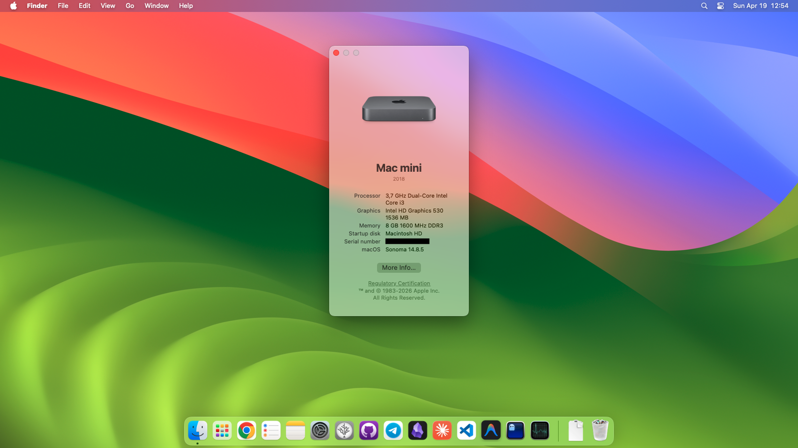

# 🖥️ Dell Optiplex 3040 Hackintosh – OpenCore EFI

<p align="center">
  
</p>

---

<p align="center">
  
</p>

> ✅ macOS Sonoma 14 on Dell Optiplex 3040  
> ✅ Intel HD 530 (fully accelerated)  
> ✅ No dedicated GPU  
> ✅ No OCLP required  

---

## 💻 Hardware Specifications

| Component     | Details |
|--------------|----------|
| 🖥 Motherboard | Dell Optiplex 3040 (H110 Chipset) |
| 🧠 CPU         | Intel Core i3-6100 (Skylake) |
| 🎮 GPU         | Intel HD Graphics 530 |
| 🔊 Audio       | Realtek ALC255 (ALC3234) — layout-id 11 |
| 🌐 Ethernet    | Realtek RTL8111 |
| 💾 Storage     | Samsung SSD PM851 128GB SATA |
| 🆔 SMBIOS      | Macmini8,1 |

---

## ✅ Working Features

- ✅ Intel HD 530 — full QE/CI acceleration (native)
- ✅ Audio (speakers + headphone jack)
- ✅ Ethernet
- ✅ **Sleep / Wake** (after applying fixes)
- ✅ USB (mapped with USBToolBox)
- ✅ CPU Power Management (XCPM, working C-states)
- ✅ iMessage / FaceTime / App Store
- ✅ Proper hardware monitoring (CPU temps, fan speeds)

---

## ❌ Not Working

- ❌ Wi‑Fi (no card installed)
- ❌ Bluetooth (no card installed)
- ❌ AirDrop / Handoff (requires Wi‑Fi + BT)

---

## 📦 Included Kexts

| Kext | Description |
|------|-------------|
| Lilu | Patch engine (required) |
| VirtualSMC | SMC emulation |
| SMCProcessor | CPU monitoring |
| SMCSuperIO | Fan monitoring |
| AppleALC | Audio support (layout-id 11) |
| WhateverGreen | iGPU patches |
| RealtekRTL8111 | Ethernet |
| RestrictEvents | Macmini8,1 Sonoma compatibility |
| USBToolBox | USB mapping engine |
| USBMap | Custom USB map for Optiplex 3040 |

---

## 🎨 Intel HD 530 – DVMT Fix (No BIOS Mod Required)

The Optiplex 3040 BIOS locks **DVMT Pre-Allocated to 7MB**.  
macOS requires at least **64MB** for proper acceleration.

This EFI resolves the issue entirely via **WhateverGreen framebuffer patches**.

### 🔧 Device Properties

| Key | Value | Purpose |
|-----|-------|---------|
| `AAPL,ig-platform-id` | `00001259` | HD 530 desktop framebuffer |
| `device-id` | `12590000` | Native Sonoma support spoof |
| `framebuffer-stolenmem` | `AAAwAQ==` (19MB) | DVMT override |
| `framebuffer-fbmem` | `AACQAA==` (9MB) | Framebuffer memory |
| `force-online` | `AQAAAA==` | Force framebuffer online |
| `framebuffer-con0/con1-type` | `AAgAAA==` | HDMI connectors |

### 🏁 Boot Arguments

```
igfxonln=1 -igfxdvmt keepsyms=1
```

✅ Fully accelerated  
✅ No OCLP  
✅ No BIOS modification  

---

## ⚙️ OpenCore Configuration Highlights

| Setting | Value | Reason |
|----------|--------|--------|
| SMBIOS | Macmini8,1 | Best Skylake desktop match |
| SecureBootModel | Disabled | Required |
| AppleXcpmCfgLock | true | BIOS CFG Lock is locked |
| CustomSMBIOSGuid | true | Prevents SMBIOS leakage |
| DisableIoMapper | true | Fixes VT-d issues |
| RestrictEvents Patch | `sbvmm` | Required for Sonoma |

---

## 🔧 Required BIOS Settings

| Setting | Value |
|----------|--------|
| Boot Mode | UEFI |
| Secure Boot | Disabled |
| SATA Operation | AHCI |
| Serial Port | Disabled |
| CFG Lock | Locked (handled via quirk) |

---

## 🌙 Sleep / Wake Fix

By default, sleep is unstable. To make it work perfectly, you need to apply these settings.

### 1. Terminal Commands
Open Terminal and run the following commands:
```bash
# Set proper idle timers (display off after 10m, system sleep after 15m)
sudo pmset -a sleep 15 displaysleep 10 disksleep 10

# Disable network activity during sleep (prevents random wakes)
sudo pmset -a tcpkeepalive 0

# Disable wake by nearby Apple devices
sudo pmset -a proximitywake 0
```
### 2. Dell BIOS Power Settings
Restart and press **F2** to enter BIOS. Go to `Power Management` and set:
| Setting | Value |
|----------|--------|
| **Deep Sleep Control** | **Enabled in S4 and S5** |
| **USB Wake Support** | **Disabled** |

This prevents instant wake-ups from USB devices like gaming mice.

---

## 🔐 Important

> 🔴 **Generate your own SMBIOS** using:  
> https://github.com/corpnewt/GenSMBIOS  
>
> Never use serial numbers from this repository.

---

## 📚 Credits

- Dortania OpenCore Install Guide  
- WhateverGreen Documentation  
- USBToolBox  
- Acidanthera Team  

---

## 📄 License

MIT License — free to use, modify and share.

---

⭐ If this EFI helped you, consider leaving a star
